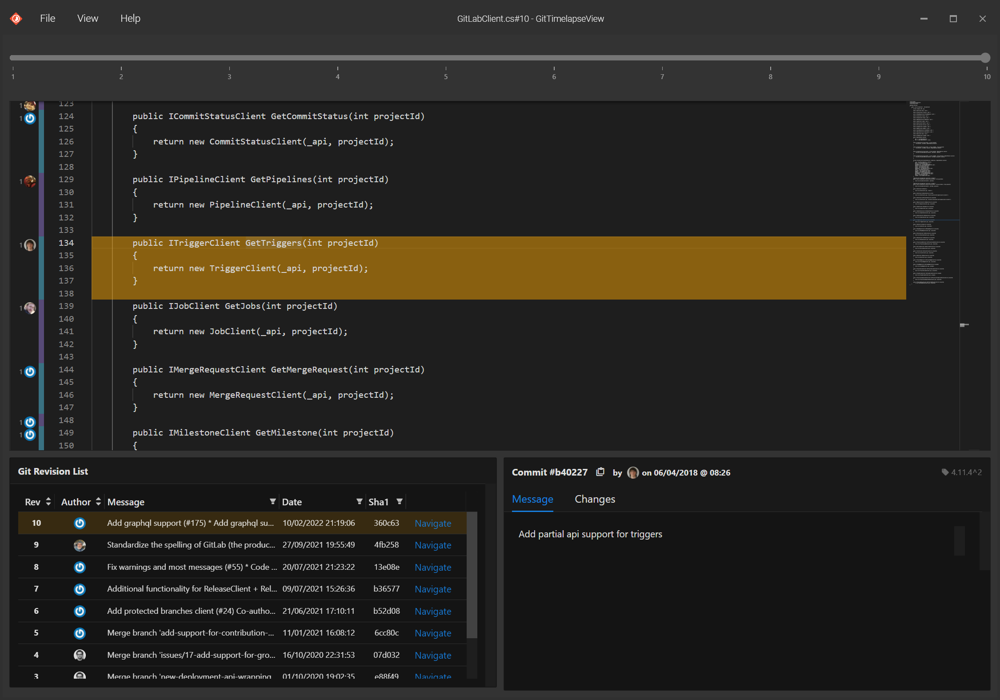

# GitTimelapseView

GitTimelapseView allows you to easily monitor the evolution of your Git files over time. It adds a timeline to your blame view

## Why is it helpful?

Viewing the different versions of a file on the same window will help you find the exact time and commit which introduced new bugs or features. By using the git project's history GitTimelapseView also helps you find the last person who modified each part of the file so you always know who to ask when the code gets obscure.

## Contributing

We would love you to contribute to `@ubisoft/GitTimeLapseView`, pull requests are welcome! Please see the [CONTRIBUTING.md](CONTRIBUTING.md) for more information.

## License

The scripts and documentation in this project are released under the [Apache License](LICENSE)
